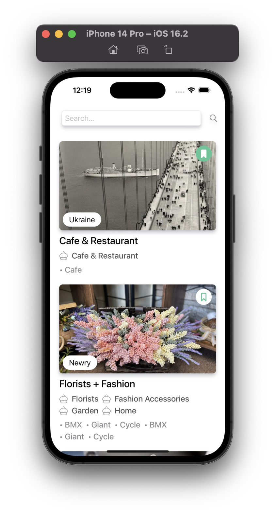
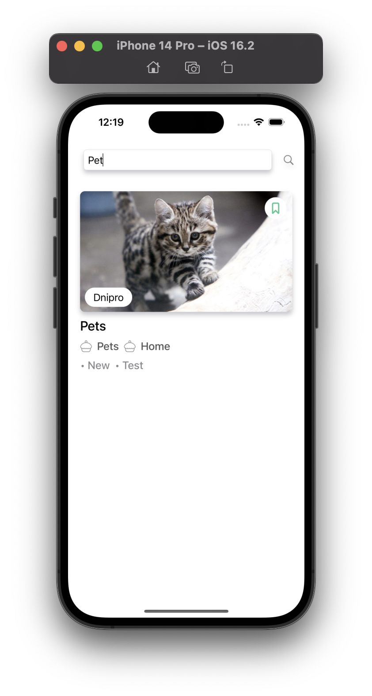
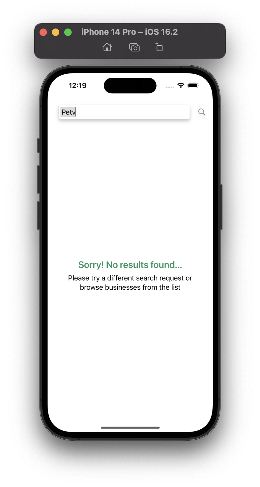

<h1>Cafes SwiftUI</h1>

	
	
	
	

<h2>Features</h2>
<ul>
	<li>The network layer is mocked (a JSON sample is available in the repository files, vendors.json);</li>
	<li>The search starts automatically after a user has typed at least 3 symbols, with a 0.5-second debouncing period;</li>
	<li>The items are filtered by the company_name field.</li>
</ul>

<h2>Usage</h2>

The user has the option to toggle pictures on the iPhone search vendor by name:

	
	
	

<h2>Architecture</h2>
<ul>
	<li>Consideration of screen rotation</li>
	<li>MVVM design pattern</li>
	<li>SDWebImage library Cocoapods</li>
</ul>

<h2>Used API</h2>
<ul>
	<li>Mock Data</li>
</ul>

<h2>Installation</h2>

To install the app and dependencies:

<ol>
	<li>Clone the repository</li>
	<li>Run 'pod install' to install the SDWebImage library</li>
	<li>Open the project in Xcode</li>
	<li>Build and run the app</li>
</ol>

<h2>License</h2>

This project is licensed under the MIT License. See the LICENSE file for details.

